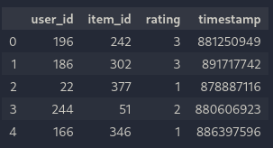
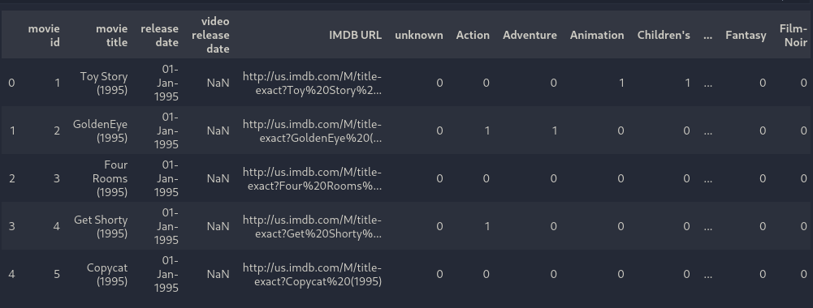
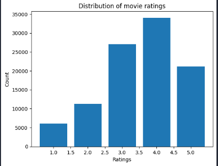
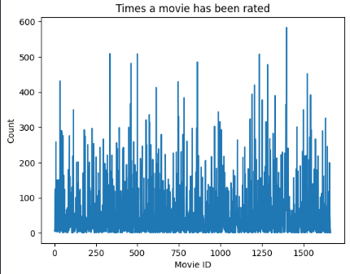
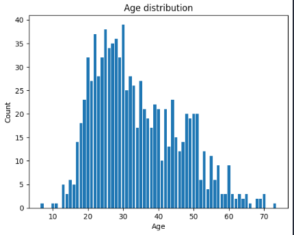
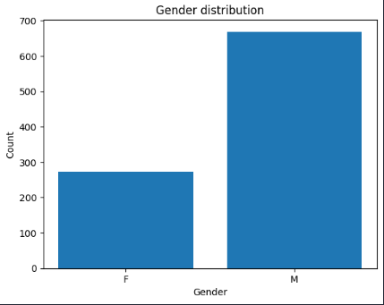
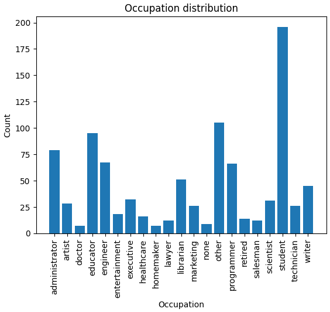

# Introduction

A recommender system is a type of information filtering system that suggests items or content to users based on their interests, preferences, or past behavior. This project's goal is to employ a user-based collaborative filtering approach to suggest movies to a user. For this project a data set of 100,000 movie ratings provided by MovieLens, consisting of 943 users and 1682 movies was used. To suggest movies to the user, this dataset was utilized to identify people with comparable movie ratings.

# Data analysis 

The main dataset: u.data, consists of 100000 rows and 4 columns: user_id, item_id, rating and timestamp.

Another dataset, u.item, along with the rest of the data, provides a very important mapping: movie_id to movie_title.

In the process of analyzing movie ratings given by users, it was found that there are 18 cases when the same user rated the same movie several times. Therefore we need to average such ratings and remove repeated evaluations.

There are several distributions of the data:

From the distribution of the users age we can observe that people from 20 to 30 years old rate films more often than others. Perhaps we will see that a particular occupation will be appearing more frequently than others.

More detailed data analysis is done in notebook 1-0.

# Model implementation

To recommend a film to a user, k-nearest neighbours (k-NN) was used. K-NN is a supervised machine learning algorithm that can be used for classification and regression. First, the data is loaded from the files provided by the MovieLens dataset into Pandas dataFrames to make the data easier to work with. Then the data was transformed to the pivot table, where columns are movie titles and rows are user's rating to the corresponding movie. In order to fit the knn model with metric - cosine similarity and bruteforce algorithm, the pivot table was transformed to the sparse matrix. The cosine similarity metric was chosen because it is fast in computation for spaese matrices, and bruteforce was chosen as an algorithm because the dataset is small.

## Model Advantages and Disadvantages

### Advantages:
* Easy to impement.
* Lightweight model.
* Fast on sparse matrices.
* Domain independent.
* Excellent predicted rating of the recommended movies. (Average of the top K predicted movie's rating is approximately 4.85)

### Disadvantages:
* For example, we have a splitted data into train and test sets, if I train the knn model on the train data and then propose movies to the user, this recommended movies will coincide with the movies from the test set at maximum only for 10%. This value is not satisfactory, it would be nice to have approximately 50% of similarity between test set and recommended movies. Howeever, apart from the test set, it also recommends the movies which the user did not watch.
* Also I would say one of the drawbacks is the data dimensionality. Imagine having one million users who rated 500k movies. Than for each movie there will be a column and a row for each user.
* Cannot recommend movies outside of the training data.

### Training Process

Collaborative filtering approach does not have any training process. There are several steps to start making predictions:
- Generate a sparse matrix from the movie ratings.
- Fit this matrix to knn model. 
- Similar users are ready to recommend movies!

## Evaluation

For the evaluation purposes I used:
* Mean average precision - 0.38.
* Mean predicted rating of the recommended films - 4.85.
* Set intersection between test set of the movies and predicted set of the movies - 0.093.

To reproduce this results just run the evaluate.py in the benchmark folder of the project.

# Results

The implemented system for movie recommendations using k-nearest neighbors approach with cosine similarity as evaluation and bruteforce approach as an algorithm. This model was trained on the MovieLens100k dataset. The model proposes to the user a new movies for watching alongside with the predicted rating this user may give for the particular recommended movie. For the evaluation I used MAP@k, mean predicted rating of the recommended films, and set intersection between test set of the movies and predicted set of the movies.